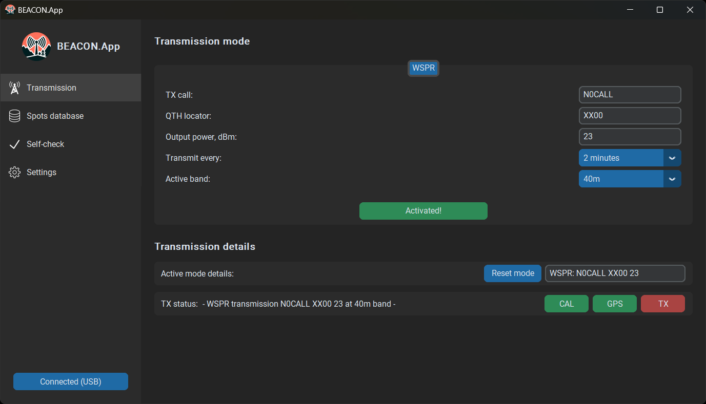

# BEACON.App



## Building
Download and install the [latest version of Python for Windows](https://www.python.org/ftp/python/3.13.1/python-3.13.1-amd64.exe).

### Building the executable File
```sh
git clone https://github.com/IgrikXD/WSPR-beacon.git
cd WSPR-beacon/App
pip install pyinstaller
pyinstaller --noconsole --onefile --icon=beaconapp/resources/beacon-app-logo.ico --add-data "beaconapp/resources/*;resources" beaconapp/main.py
```