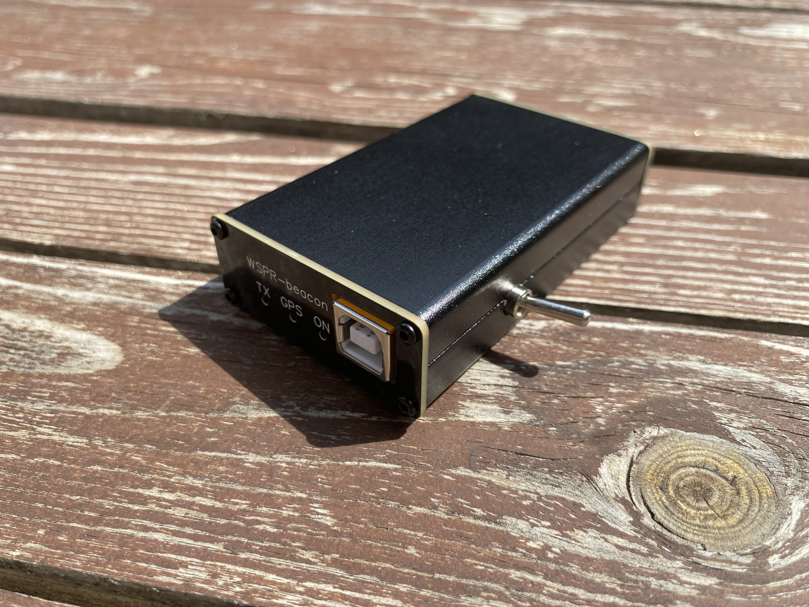

# Assembly guide

## PCB requirements
When manufacturing the PCB, use FR-4 material with a thickness of 1.6 mm and a copper weight oequal to 1 oz. Although this is not the best material for radio frequency equipment, it is the most popular and widely available. The use of FR-4 material is necessary to ensure the wawe impedance of the RF line is 50 ohms. Failure to meet this requirement will result in additional signal loss during device operation. The impedance calculations were performed for a material with a dielectric constant Er = 4.6 (FR-4) using the [Saturn PCB Design V7.08](http://www.saturnpcb.com/pcb_toolkit/) toolkit.

## Requirements for Atmega328

When using Atmega328 distributed as individual electronic components, you will encounter a firmware upload error:
```log
avrdude: stk500_recv(): programmer is not responding 
avrdude: stk500_getsync() attempt 1 of 10: not in sync: resp=0x88
```

This is because **Atmega328 chips distributed as individual electronic components do not have a built-in bootloader** – they are completely blank chips, making it impossible to upload firmware via the Arduino IDE. Since the WSPR beacon PCB does not have an ISP interface, **you need to use an Atmega328 chip with a pre-flashed bootloader when assembling the device**. The best solution in this situation might be to move the Atmega328 chip from a ready-made Arduino Nano board. Such a chip already has a pre-flashed bootloader, allowing you to upload the WSPR beacon firmware without any problems.

## Winding a bifilar transformer
For winding a bifilar transformer, I recommend you use the instructions from [QRP-Labs: "10-turn bifilar-winding option"](https://qrp-labs.com/images/ultimate3s/assembly_u3s_r3_lt.pdf).  

**The only difference lies in the method of soldering the bifilar transformer on the PCB:** you need to solder the end of the primary winding to the beginning of the secondary winding - this will be one of the transformer leads, which is soldered as the central contact of the transformer on the PCB.

  

## Installing the PCB in the aluminum enclosure

To assemble the device, an aluminum case with dimensions 80 x 50 x 20 mm is used.

Install the PCB in one part of the enclosure by placing it on the appropriate chassis. Screw on the side covers of the chassis and tighten the nuts on the SMA connectors - this will secure the PCB and allow you to mark the locations for cutting the holes for the SW1 toggle switch. Take the SW1 toggle switch and place it in the mounting location on the PCB. The area where the toggle switch contacts the side of the case must be milled (_you can use a 6mm round file_) so that the toggle switch can be positioned and soldered to the PCB.  

  

Mark the same point on the top of the aluminum enclosure.  

  

Unscrew the side covers of the enclosure, remove the PCB and use a file to cut the hole for the toggle switch to the correct depth. After cutting, put the PCB back into the case and check how freely the toggle switch fits into the cut-out hole. If you are unable to install the toggle switch correctly, repeat the above steps until optimal results are achieved.  

 

Insert the PCB back into the enclosure, screw on the side covers of the aluminum enclosure, and tighten the nuts on the SMA connectors, then solder the SW1 toggle switch.

  

After soldering clean the PCB to remove any flux residues. Screw the top cover of the aluminum enclosure. Now the device is ready to work.

  

## Adjusting the output amplifier
To adjust the output amplifier, I recommend you use the instructions from [QRP-Labs: "PA bias set-up"](https://qrp-labs.com/images/ultimate3s/assembly_u3s_r3_lt.pdf).

For additional cooling of the BS170 transistor, you can use an off-the-shelf aluminum heatsink for TO-92 package transistors.  

  