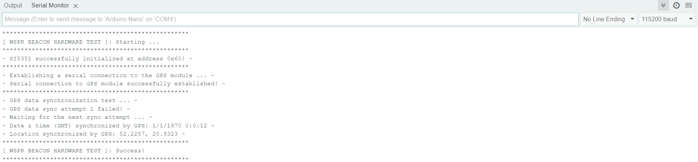

# Firmware instructions

> [!NOTE]
> This firmware version is **compatible only** with devices based on the **ATmega328P** (versions [1.0](../../../PCB/1.0/README.md) and [2.0](../../../PCB/2.0/README.md))!

This firmware checks the correctness of the LEDs initialization (_visual inspection_), SI5351 IC initialization, the correctness of the serial connection with the GPS module, and GPS data synchronization.

To get a report on the hardware functionality, [build and upload](#firmware-building) the [wspr-beacon-hardware-test](./wspr-beacon-hardware-test.ino) firmware, open the "_Tools_" -> "_Serial Monitor_" in the Arduino IDE, and turn on the device.

**An example of an hardware test report:**


## Select the board:
Open [Arduino IDE](https://www.arduino.cc/en/software), go to "_Tools_" -> "_Board_", then select  "_Arduino Nano_".

## Choose the communication port:
Connect the device to your computer via USB cable. Then, in the "_Tools_" -> "_Port_" menu, select the target COM port.

## Firmware building:
Before building the firmware using Arduino IDE, you **need to install all the required dependencies**. You can automatically install all the necessary dependencies using Arduino CLI. Download and extract the [latest version of Arduino CLI](https://downloads.arduino.cc/arduino-cli/arduino-cli_latest_Windows_64bit.zip) into the directory containing the firmware you want to build. Run the following command to automatically download dependencies and build the firmware:
```powershell
./arduino-cli compile --export-binaries
```

## Upload an firmware:
Click the "_Upload_" button in the Arduino IDE to build and upload firmware to the device.

Alternatively, you can upload the precompiled _.hex_ file (_located in the build/arduino.avr.nano directory_) directly to the device using Arduino CLI:
```powershell
./arduino-cli upload --input-file build/arduino.avr.nano/<FIRMWARE_NAME>.hex --port <TARGET_PORT> --verify
```