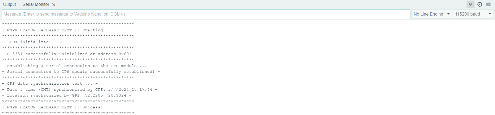

# Firmware instruction

## Select the board:
Open [Arduino IDE](https://www.arduino.cc/en/software), go to "_Tools_" -> "_Board_", then select  "_Arduino Nano_".

## Choose the communication port:
Connect the device to your computer via USB cable. Then, in the "_Tools_" -> "_Port_" menu, select the target COM port.

## Verification of hardware operability after device assembly
After assembling the device, you can upload [firmware for testing the hardware](./wspr-beacon-hardware-test/wspr-beacon-hardware-test.ino).

> [!NOTE]
>This is an optional step, you can skip it. I recommend using this firmware if you encounter issues with the device's functionality when using the main wspr-beacon firmware.

This firmware checks the correctness of the LEDs initialization (_visual inspection_), SI5351 IC initialization, the correctness of the serial connection with the GPS module, and GPS data synchronization.

To get a report on the hardware functionality, [builld and upload](#firmware-building) the [wspr-beacon-hardware-test](./wspr-beacon-hardware-test/wspr-beacon-hardware-test.ino) firmware, open the "_Tools_" -> "_Serial Monitor_" in the Arduino IDE, and turn on the device.

**An example of an hardware test report:**


## I2C address of the SI5351:
By default, the SI5351 uses address **_0x60_** on the I2C bus. If necessary, you can change the I2C address of the SI5351 according to the datasheet of your instance:
```cpp
#define SI5351_I2C_ADDRESS         0x60
```

## SI5351 calibration:
For correct operation of the device you need to [calibrate](https://github.com/etherkit/Si5351Arduino/tree/master?tab=readme-ov-file#calibration) the SI5351 to calculate the difference between the uncalibrated actual frequency and the nominal output frequency. 

> [!NOTE]
>By default, the sketch for calibrating the SI5351 is set to operate with an output frequency of 10 MHz. If you do not have equipment that can operate at this frequency, you can use an SDR receiver like RTL-SDR.COM and a modified calibration sketch by changing the operating frequency to 28 MHz.

Upload this [sketch](https://github.com/etherkit/Si5351Arduino/blob/master/examples/si5351_calibration/si5351_calibration.ino) into the device and perform the calibration. Calibration is performed once for each pair of SI5351 and TCXO. The resulting calibration value must be changed in the [_wspr-beacon-1.1.ino_](./wspr-beacon-1.1/wspr-beacon-1.1.ino) file: 
```cpp
#define SI5351_CAL_FACTOR          2000
```

## Select the transmission frequency:
Uncomment the line with the band on which you want to perform the WSPR message transmission:
```cpp
// WSPR center frequency in Hz
// #define WSPR_DEFAULT_FREQ       137500ULL    // 0.1375 MHz - 2200m
// #define WSPR_DEFAULT_FREQ       475700ULL    // 0.4757 MHz - 600m
// #define WSPR_DEFAULT_FREQ       1838100ULL   // 1.8381 MHz - 160m
// #define WSPR_DEFAULT_FREQ       3570100ULL   // 3.5701 MHz - 80m
// #define WSPR_DEFAULT_FREQ       5288700ULL   // 5.2887 MHz - 60m
// #define WSPR_DEFAULT_FREQ       7040100ULL   // 7.0401 MHz - 40m
// #define WSPR_DEFAULT_FREQ       10140200ULL  // 10.1402 MHz - 30m
// #define WSPR_DEFAULT_FREQ       14097100ULL  // 14.0971 MHz - 20m
// #define WSPR_DEFAULT_FREQ       18106100ULL  // 18.1061 MHz - 17m
// #define WSPR_DEFAULT_FREQ       21096100ULL  // 21.0961 MHz - 15m
// #define WSPR_DEFAULT_FREQ       24926100ULL  // 24.9261 MHz - 12m
#define WSPR_DEFAULT_FREQ       28126100ULL  // 28.1261 MHz - 10m
// #define WSPR_DEFAULT_FREQ       50294500ULL  // 50.2945 MHz - 6m
// #define WSPR_DEFAULT_FREQ       144490000ULL  // 144.4900 MHz - 2m
```

> [!NOTE]
>At this step you select the center frequency. Each transmission cycle is performed at a randomly selected frequency within a range of +/- 100 Hz from the center frequency.

## Add WSPR message data:
Enter your amateur radio call sign to generate a correct WSPR message:
```cpp
#define WSPR_CALL                 "XX0YYY"
```
There is no need to specify your QTH locator, it will be calculated automatically by _void setQTHLocator()_ function based on actual GPS data.

## Firmware building:
Before building the firmware using Arduino IDE, you **need to install all the required dependencies**. You can automatically install all the necessary dependencies using Arduino CLI. Download and extract the [latest version of Arduino CLI](https://downloads.arduino.cc/arduino-cli/arduino-cli_latest_Windows_64bit.zip) into the directory containing the firmware you want to build. Run the following command to automatically download dependencies and build the firmware:
```powershell
./arduino-cli compile --export-binaries
```

## Upload an firmware:
Click the "_Upload_" button in the Arduino IDE to build and upload firmware to the device.

Alternatively, you can upload the precompiled _.hex_ file (_located in the build/arduino.avr.nano directory_) directly to the device using Arduino CLI:
```powershell
./arduino-cli upload --input-file build/arduino.avr.nano/<FIRMWARE_NAME>.hex --port <TARGET_PORT> --verify
```