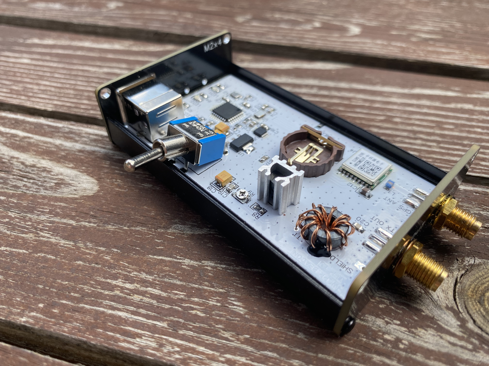
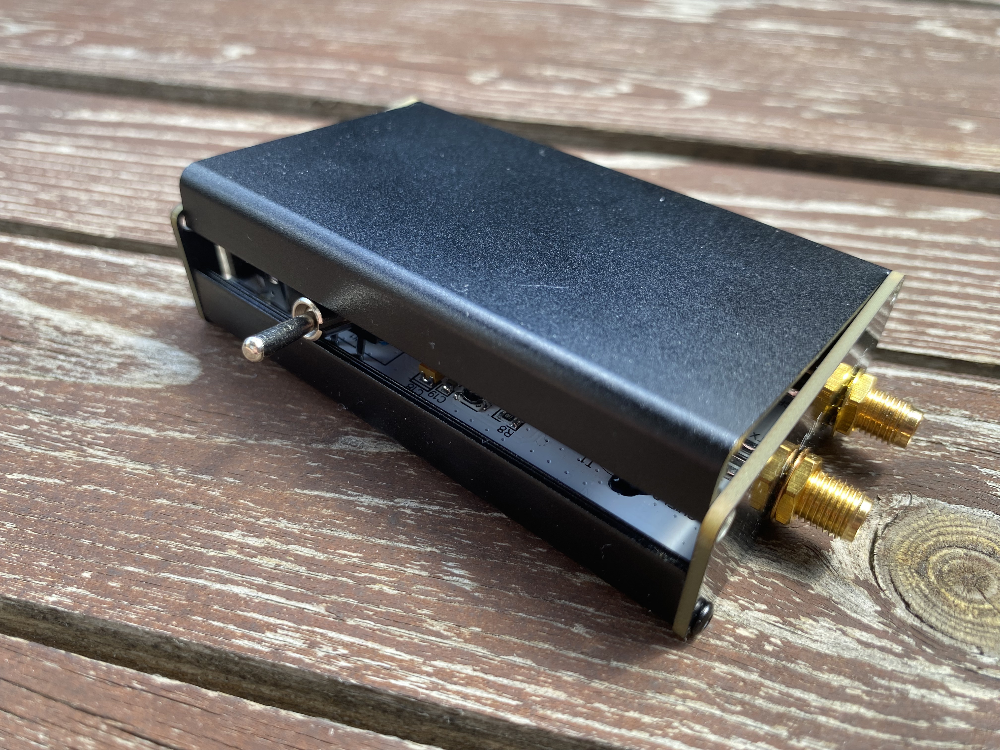
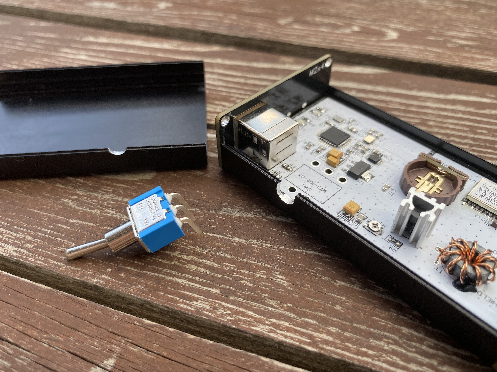
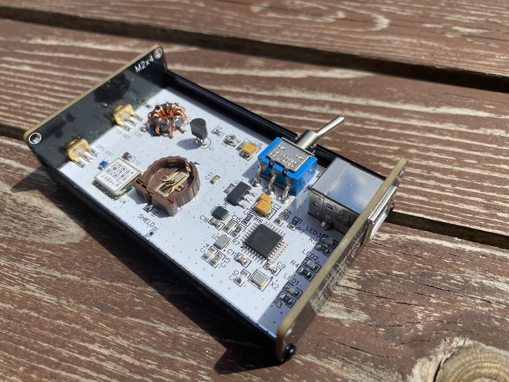
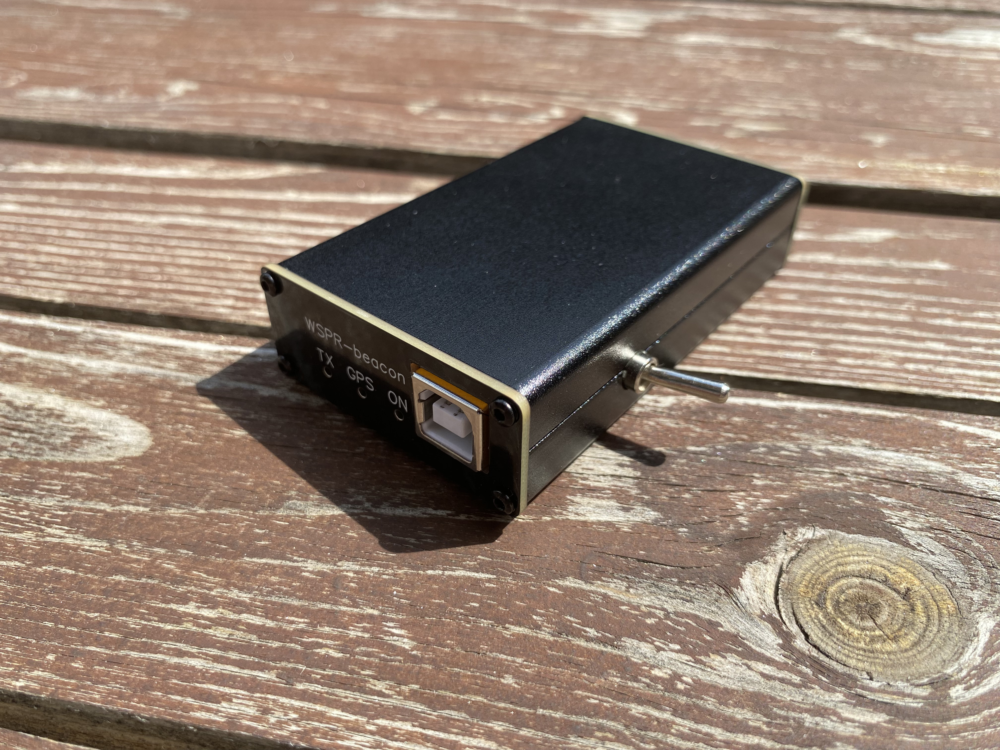

# Assembly guide

## Requirements for Atmega328

When using Atmega328 distributed as individual electronic components, you will encounter a firmware upload error:
```log
avrdude: stk500_recv(): programmer is not responding 
avrdude: stk500_getsync() attempt 1 of 10: not in sync: resp=0x88
```

This is because **Atmega328 chips distributed as individual electronic components do not have a built-in bootloader** – they are completely blank chips, making it impossible to upload firmware via the Arduino IDE. Since the WSPR beacon PCB does not have an ISP interface, **you need to use an Atmega328 chip with a pre-flashed bootloader when assembling the device**. The best solution in this situation might be to move the Atmega328 chip from a ready-made Arduino Nano board. Such a chip already has a pre-flashed bootloader, allowing you to upload the WSPR beacon firmware without any problems.

## Installing the PCB in the aluminum enclosure

> [!NOTE]
>The photos below show the version 1.0 PCB. **Installing the version 2.0 PCB into the aluminum enclosure is done in exactly the same way.** The photos are provided as an example of how to properly prepare the enclosure for PCB mounting.

To assemble the device, an aluminum case with dimensions 80 x 50 x 20 mm is used.

Install the PCB into one half of the enclosure by placing it onto the internal mounting tray. Screw on the side covers of the enclosure and tighten the nuts on the SMA connectors - this will secure the PCB and allow you to mark the locations for cutting the holes for the SW1 toggle switch. Take the SW1 toggle switch and place it in the mounting location on the PCB. The area where the toggle switch contacts the side of the case must be milled (_you can use a 6mm round file_) so that the toggle switch can be positioned and soldered onto the PCB.  

  

Mark the same point on the top of the aluminum enclosure.  

  

Unscrew the side covers of the enclosure, remove the PCB and use a file to cut the hole for the toggle switch to the correct depth. After cutting, put the PCB back into the case and check how freely the toggle switch fits into the cut-out hole. If you are unable to install the toggle switch correctly, repeat the above steps until optimal results are achieved.  

 

Insert the PCB back into the enclosure, screw on the side covers of the aluminum enclosure, and tighten the nuts on the SMA connectors, then solder the SW1 toggle switch.

  

After soldering clean the PCB to remove flux residues. Screw the top cover of the aluminum enclosure. The device is now ready for operation.

  
