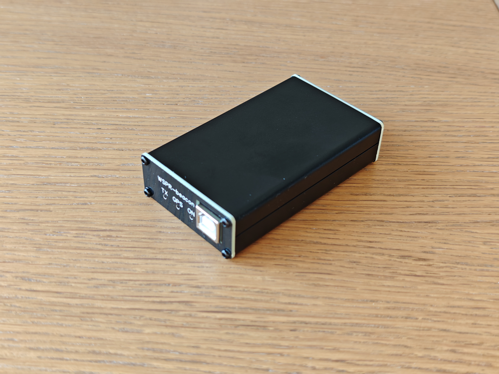

# Assembly guide

## Installing the PCB in the aluminum enclosure

To assemble the device, an aluminum case with dimensions 80 x 50 x 20 mm is used. 

In PCB version 3.3, one of the side panels of the enclosure contains a built-in 2.4 GHz Wi-Fi antenna, which is connected to the ESP32-C3 SoC using a small coaxial cable with IPEX connectors. Before installing the PCB into the aluminum enclosure, connect the IPEX cable to the corresponding RF connectors.

 

Install the PCB into one half of the enclosure by placing it onto the internal mounting tray.

 

Screw on the side cover of the enclosure.

 

Install the second side cover, then tighten the screws and the SMA connector nuts.

 

Install the top cover and tighten the screws. The device is now ready for operation.

