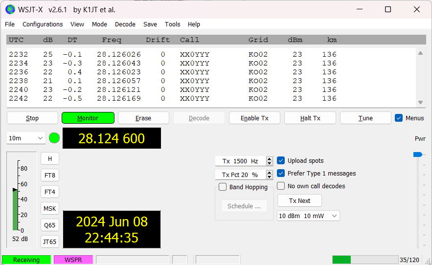

# WSPR-beacon

A small hardware device for transmitting WSPR messages based on the SI5351 IC. The device has a built-in TCXO to eliminate SI5351 frequency drift, a built-in GPS module for operation with active GPS antennas, transmission time synchronization and automatic QTH locator calculation, and a simple amplifier based on a single BS170 transistor ([_PCB version 1.0_](https://github.com/IgrikXD/WSPR-beacon/releases/tag/wspr-beacon-1.0)) or buffer amplifier based on a 74ACT244 IC ([_PCB version 2.0_](https://github.com/IgrikXD/WSPR-beacon/releases/tag/wspr-beacon-pcb-2.0)). PCB is made on based on SMD components and adapted for installation in an aluminum enclosure with dimensions 80 x 50 x 20 mm.

## Current development progress:
&nbsp;&nbsp;   

Correctness of encoding of the transmitted WSPR message was verified by decoding the transmission using a locally located Airspy R2 SDR receiver and the [WSJT-X](https://wsjt.sourceforge.io/wsjtx.html) application.

## Basic characteristics of the WSPR-beacon:
**RF connectors:** SMA  
**Feed line:** 50 Ohm coaxial cable  
**GPS antenna type:** active, external  
**Maximum output power:** ~23 dBm  
**Supply voltage:** 5V, USB-B, fuse-protected  
**Used PCB Material:** FR-4  
**PCB thickness:** 1.6 mm  
**PCB copper weight:** 1 oz  

## How to use this repository?
The [Firmware](./Firmware/) folder contains software required for the device operation and [firmware instructions](./Firmware/README.md). The [Schematics](./Schematics/) directory contains the device schematic file in _.pdf_ format. The [Gerbers](./Gerbers/) directory contains files necessary for ordering PCB and side covers [fabrication at the factory](https://www.pcbway.com/project/shareproject/WSPR_beacon_f64d290a.html).  

Additionally, you can find information about the [list of required components](./BOMs), [assembly guide](./Assembly-guide.md), [operating instructions](./Usage-guide.md) and [device test report](./Device-test-report.md).

## Resources:
[A Little WSPR Beacon (Aren’t They All Little?) – Dave Richards AA7EE](https://aa7ee.wordpress.com/2023/02/26/a-little-wspr-beacon-arent-they-all-little/)  
[Bifilar and trifilar PA](https://qrp-labs.com/ultimate3/u3info/u3sbifilar.html)  
[ESP WSPR – Simple and Inexpensive WSPR Transmitter - Ankara Telsiz ve Radyo Amatörleri Kulübü Derneği](https://antrak.org.tr/blog/esp-wspr-simple-and-inexpensive-wspr-transmitter/)  
[FDIM 2024 LOGIC IC TRANSMITTER CHALLENGE - Ankara Telsiz ve Radyo Amatörleri Kulübü Derneği](https://antrak.org.tr/haberler/fdim-2024-logic-ic-transmitter-challenge/)  
[HarrydeBug/WSPR-transmitters: Arduino firmware for ZachTek WSPR transmitters.](https://github.com/HarrydeBug/WSPR-transmitters/tree/master)  
[K1FM-WSPR-TX - GitHub](https://github.com/adecarolis/K1FM-WSPR-TX)  
[QRP Labs QRSS/WSPR TX Kit](https://qrp-labs.com/images/ultimate3s/assembly_u3s_r3_lt.pdf)  
[WSPR beacon – Projets radio](https://hamprojects.wordpress.com/2019/06/02/wspr-beacon/)  
[WSPR - Signal Identification Wiki](https://www.sigidwiki.com/wiki/WSPR)  

## Who helped me with the development of the project?
Great thanks to [PCBWay](https://pcbway.com) for manufacturing the PCBs for the project as a sponsored contribution.

## How to contact me?
- E-mail: igor.nikolaevich.96@gmail.com
- Telegram: https://t.me/igrikxd
- LinkedIn: https://www.linkedin.com/in/igor-yatsevich/