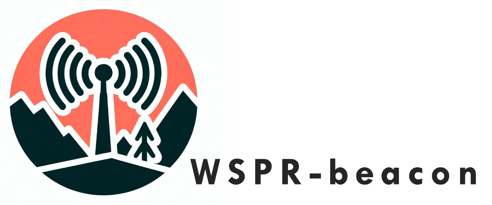
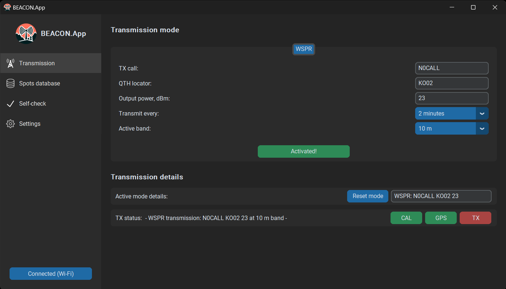
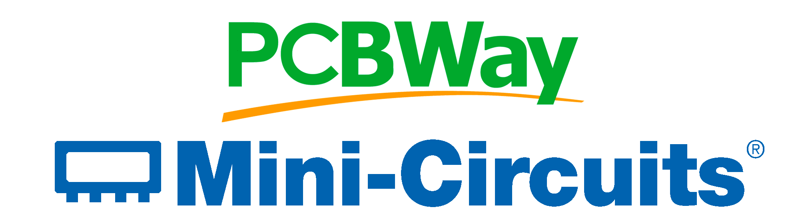

# WSPR-beacon

A compact hardware device for transmitting WSPR messages based on the ESP32-C3 SoC. The RF signal is generated by an SI5351 clock generator referenced to a high-stability TCXO to eliminate frequency drift. An integrated GPS module compatible with active antennas provides precise transmission timing and automatic QTH locator calculation. The RF output is buffered by a driver stage based on a 74ACT244 IC. The SMD-based PCB is designed to fit into a standard 80 × 50 × 20 mm aluminum enclosure.

## Project support
[![BTC: Make a donation][BTC-badge]](https://nowpayments.io/donation/wsprbeacon)&nbsp;[![PayPal: Make a donation][PayPal-badge]](https://www.paypal.com/donate/?hosted_button_id=Q8PRFPXKKSDAQ)&nbsp;[![Revolut: Make a donation][Revolut-badge]](https://revolut.me/iharygxob)

Your support helps me continue developing open-source projects like [WSPR-beacon](#WSPR-beacon) and [Easy-SDR](https://github.com/IgrikXD/Easy-SDR), while also enabling the creation of new tools that benefit the community.

## Current development progress
[![Progress][EasyEDA-badge]](https://oshwlab.com/igrikxd/wspr-beacon)&nbsp;  
[![GitHub Actions: Firmware build status][Firmware-build-badge]](https://github.com/IgrikXD/WSPR-beacon/actions/workflows/firmware-build.yml)&nbsp;  
[![GitHub Actions: App build Windows status][App-build-Windows-badge]](https://github.com/IgrikXD/WSPR-beacon/actions/workflows/app-build-windows.yml)&nbsp;[![GitHub Actions: App build Linux status][App-build-Linux-badge]](https://github.com/IgrikXD/WSPR-beacon/actions/workflows/app-build-linux.yml)&nbsp; 

The transmitted WSPR message's correctness was verified by decoding the transmission using a locally located [RTL-SDR.COM V.4 SDR receiver](https://www.rtl-sdr.com/buy-rtl-sdr-dvb-t-dongles/) and the [WSJT-X](https://wsjt.sourceforge.io/wsjtx.html) application. Also, you can see the [results of testing the device during long-distance WSPR message transmission](./Device-test-report.md).

## How to use this repository?
The [App](./App/) directory contains the source code and [build instructions](./App/README.md) for **BEACON.App** - a cross-platform GUI application for configuring and managing the device via USB or Wi-Fi. The [Firmware](./Firmware/) directory contains the software required for device operation, along with [firmware installation instructions](./Firmware/ESP32C3-based/README.md). The [PCB](./PCB/) directory contains everything required for factory manufacturing and assembly, including the **Gerber**, **BOM**, **schematic** and **assembly guide** for different device revisions. 

For device usage details, refer to the [operating instructions](./Firmware/ESP32C3-based/Usage-guide.md).

> [!IMPORTANT]
> **The project includes several device versions that are distributed under different terms.**
>
> Devices based on the **ATmega328P MCU** (_PCB versions [1.0](./PCB/1.0/) and [2.0](./PCB/2.0/)_) and the [firmware](./Firmware/ATmega328P-based/README.md) provided for them are fully open-source and available for self-manufacturing.
>
> Devices based on the **ESP32-C3 SoC** (_PCB version [3.3](./PCB/3.3/) and later_) have an open-hardware design but closed, proprietary [firmware](./Firmware/ESP32C3-based/README.md) that is distributed only as a pre-encrypted and signed binary form. The firmware runs only on devices with explicitly provisioned Flash Encryption and Secure Boot v2 keys. **It is not possible to run the publicly distributed firmware on self-assembled devices!** You can either develop your own firmware for ESP32-C3-based devices, or [purchase a ready-made device](https://linktr.ee/wsprbeacon) that can run the publicly distributed firmware.

## Resources
[A Little WSPR Beacon (Aren’t They All Little?) – Dave Richards AA7EE](https://aa7ee.wordpress.com/2023/02/26/a-little-wspr-beacon-arent-they-all-little/)  
[Bifilar and trifilar PA](https://qrp-labs.com/ultimate3/u3info/u3sbifilar.html)  
[ESP WSPR – Simple and Inexpensive WSPR Transmitter - Ankara Telsiz ve Radyo Amatörleri Kulübü Derneği](https://antrak.org.tr/blog/esp-wspr-simple-and-inexpensive-wspr-transmitter/)  
[FDIM 2024 LOGIC IC TRANSMITTER CHALLENGE - Ankara Telsiz ve Radyo Amatörleri Kulübü Derneği](https://antrak.org.tr/haberler/fdim-2024-logic-ic-transmitter-challenge/)  
[HarrydeBug/WSPR-transmitters: Arduino firmware for ZachTek WSPR transmitters.](https://github.com/HarrydeBug/WSPR-transmitters/tree/master)  
[K1FM-WSPR-TX - GitHub](https://github.com/adecarolis/K1FM-WSPR-TX)  
[QRP Labs QRSS/WSPR TX Kit](https://qrp-labs.com/images/ultimate3s/assembly_u3s_r3_lt.pdf)  
[WSPR - Signal Identification Wiki](https://www.sigidwiki.com/wiki/WSPR)  

## Who helped me with the development of the project?
Many thanks to [RTL-SDR.COM](https://www.rtl-sdr.com/) for providing RTL-SDR.COM V.4 SDR receiver samples and informational support, to [PCBWay](https://pcbway.com) for manufacturing the PCBs for this project as a sponsored contribution, to [Mini-Circuits](https://www.minicircuits.com/) for providing transformer samples through their [EZ-Sample](https://www.minicircuits.com/WebStore/ez_sample.html) program, to [Molex](https://www.molex.com/en-us/home) for supplying GPS receive antennas, to [Samtec](https://www.samtec.com/) for providing RF cable assemblies, and to [TE Connectivity](https://www.te.com/) for providing RF calibration kits.

## Licensing & terms of use
This project follows a multi-license model. Please review the full [licensing & terms of use](./DISCLAIMER.md) before using, modifying, or distributing any part of this project.

## How to contact me?
- E-mail: igor.nikolaevich.96@gmail.com
- Telegram: https://t.me/igrikxd
- LinkedIn: https://www.linkedin.com/in/igor-yatsevich/

To purchase a ready-made device, follow the [link](https://linktr.ee/wsprbeacon) to choose from the available options, or [contact me directly](https://t.me/igrikxd).

[BTC-badge]: https://img.shields.io/badge/BTC-Make%20a%20donation-orange.svg?logo=bitcoin&style=for-the-badge
[PayPal-badge]: https://img.shields.io/badge/PayPal-Make%20a%20donation-blue.svg?logo=&style=for-the-badge
[Revolut-badge]: https://img.shields.io/badge/Revolut-Make%20a%20donation-black.svg?logo=&style=for-the-badge
[EasyEDA-badge]: https://img.shields.io/badge/EasyEDA%20WSPR--beacon-tested-greeen.svg?logo=easyeda&style=for-the-badge
[Firmware-build-badge]: https://img.shields.io/github/actions/workflow/status/IgrikXD/WSPR-beacon/firmware-build.yml?&longCache=true&style=for-the-badge&label=Firmware%20build&logo=arduino
[App-build-Windows-badge]: https://img.shields.io/github/actions/workflow/status/IgrikXD/WSPR-beacon/app-build-windows.yml?&longCache=true&style=for-the-badge&label=App%20build%20(Windows)&logo=
[App-build-Linux-badge]: https://img.shields.io/github/actions/workflow/status/IgrikXD/WSPR-beacon/app-build-linux.yml?&longCache=true&style=for-the-badge&label=App%20build%20(Linux)&logo=linux&logoColor=F5F5F5