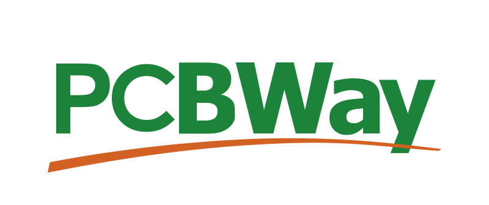

# WSPR-beacon

A small hardware device for transmitting WSPR messages based on the SI5351 IC. The device has a built-in TCXO to eliminate SI5351 frequency drift, a built-in GPS module for operation with active GPS antennas, transmission time synchronization and automatic QTH locator calculation, and a simple amplifier based on a single BS170 transistor ([_PCB version 1.0_](https://github.com/IgrikXD/WSPR-beacon/releases/tag/wspr-beacon-1.0)) or buffer amplifier based on a 74ACT244 IC ([_PCB version 2.0_](https://github.com/IgrikXD/WSPR-beacon/releases/tag/wspr-beacon-pcb-2.0)). PCB is made on based on SMD components and adapted for installation in an aluminum enclosure with dimensions 80 x 50 x 20 mm.

## Project support
[![BTC: Make a donation][BTC-badge]](https://nowpayments.io/donation/wsprbeacon)&nbsp;[![PayPal: Make a donation][PayPal-badge]](https://www.paypal.com/donate/?hosted_button_id=Q8PRFPXKKSDAQ)&nbsp;[![Revolut: Make a donation][Revolut-badge]](https://revolut.me/iharygxob)

Your support helps me continue developing open-source projects like [WSPR-beacon](#WSPR-beacon) and [Easy-SDR](https://github.com/IgrikXD/Easy-SDR), while also enabling the creation of new tools that benefit the community.

## Current development progress
[![Progress][EasyEDA-badge]](https://oshwlab.com/igrikxd/wspr-beacon)&nbsp;&nbsp;&nbsp;  

The transmitted WSPR message's correctness was verified by decoding the transmission using a locally located Airspy R2 SDR receiver and the [WSJT-X](https://wsjt.sourceforge.io/wsjtx.html) application. Also, you can see the [results of testing the device during long-distance WSPR message transmission](./Device-test-report.md).

## Basic characteristics of the WSPR-beacon
**RF connectors:** SMA  
**Feed line:** 50 Ohm coaxial cable  
**GPS antenna type:** active, external  
**Maximum output power:** ~23 dBm  
**Supply voltage:** 5V, USB-B, fuse-protected  
**Current consumption:** 65 mA (_GPS antenna not connected_) / 80 mA (_GPS antenna connected_) / 92 mA (_TX mode_)  
**Used PCB Material:** FR-4  
**PCB thickness:** 1.6 mm  
**PCB copper weight:** 1 oz  

## How to use this repository?
The [Firmware](./Firmware/) folder contains software required for the device operation and [firmware instructions](./Firmware/README.md). The [Schematics](./Schematics/) directory contains the device schematic file in _.pdf_ format. The [Gerbers](./Gerbers/) directory contains files necessary for ordering PCB and side covers [fabrication at the factory](https://www.pcbway.com/project/shareproject/WSPR_beacon_2_0_472264d9.html).  

Additionally, you can find information about the [list of required components](./BOMs), [assembly guide](./Assembly-guide.md) and [operating instructions](./Usage-guide.md).

## Resources
[A Little WSPR Beacon (Aren’t They All Little?) – Dave Richards AA7EE](https://aa7ee.wordpress.com/2023/02/26/a-little-wspr-beacon-arent-they-all-little/)  
[Bifilar and trifilar PA](https://qrp-labs.com/ultimate3/u3info/u3sbifilar.html)  
[ESP WSPR – Simple and Inexpensive WSPR Transmitter - Ankara Telsiz ve Radyo Amatörleri Kulübü Derneği](https://antrak.org.tr/blog/esp-wspr-simple-and-inexpensive-wspr-transmitter/)  
[FDIM 2024 LOGIC IC TRANSMITTER CHALLENGE - Ankara Telsiz ve Radyo Amatörleri Kulübü Derneği](https://antrak.org.tr/haberler/fdim-2024-logic-ic-transmitter-challenge/)  
[HarrydeBug/WSPR-transmitters: Arduino firmware for ZachTek WSPR transmitters.](https://github.com/HarrydeBug/WSPR-transmitters/tree/master)  
[K1FM-WSPR-TX - GitHub](https://github.com/adecarolis/K1FM-WSPR-TX)  
[QRP Labs QRSS/WSPR TX Kit](https://qrp-labs.com/images/ultimate3s/assembly_u3s_r3_lt.pdf)  
[WSPR beacon – Projets radio](https://hamprojects.wordpress.com/2019/06/02/wspr-beacon/)  
[WSPR - Signal Identification Wiki](https://www.sigidwiki.com/wiki/WSPR)  

## Who helped me with the development of the project?
Great thanks to [PCBWay](https://pcbway.com) for manufacturing the PCBs for the project as a sponsored contribution.

## How to contact me?
- E-mail: igor.nikolaevich.96@gmail.com
- Telegram: https://t.me/igrikxd
- LinkedIn: https://www.linkedin.com/in/igor-yatsevich/

You can also [contact me](https://t.me/igrikxd) to purchase preassembled devices.

[EasyEDA-badge]: https://img.shields.io/badge/EasyEDA%20WSPR--beacon-tested-greeen.svg?logo=data:image/svg+xml;base64,PHN2ZyByb2xlPSJpbWciIHZpZXdCb3g9IjAgMCAyNCAyNCIgeG1sbnM9Imh0dHA6Ly93d3cudzMub3JnLzIwMDAvc3ZnIj48dGl0bGU+RWFzeUVEQTwvdGl0bGU+PHBhdGggZD0iTTEzLjMxIDMuMTA4YTcuNjcgNy42NyAwIDAgMC0zLjAxNS41NDUgNy42NyA3LjY3IDAgMCAwLTEuNzMuOTUxIDcuODY1IDcuODY1IDAgMCAwLTEuNTkgMS41NjcgNi4zMDggNi4zMDggMCAwIDAtLjc2NC0uMDQ3QzIuNzggNi4xMjQgMCA4LjkxIDAgMTIuMzVhNi4yMTcgNi4yMTcgMCAwIDAgNC4xNDYgNS44NjggMy43NTkgMy43NTkgMCAwIDAgNy4zMjYtMS41NzRsNS4zLTIuNjczLS4wNC0uMDc4LjQ5OS0uMjU3LTEuMDIxLTIuMDI3LS40OTkuMjUtLjA0Ny0uMDg2LTUuMjkxIDIuNjU4YTMuNzI3IDMuNzI3IDAgMCAwLTIuNjI3LTEuMDc2IDMuNzcgMy43NyAwIDAgMC0zLjQyIDIuMTk4IDMuNzIzIDMuNzIzIDAgMCAxLTEuNy00LjE0NiAzLjcxIDMuNzEgMCAwIDEgNS41NDktMi4yMTQgNS4yMTEgNS4yMTEgMCAwIDEgNi41ODUtMy4zMiA1LjI0IDUuMjQgMCAwIDEgMy41MzggNC4zNzMgMi45MTMgMi45MTMgMCAwIDEgMy4xODggMi44OTkgMi45MDkgMi45MDkgMCAwIDEtMi42NSAyLjg5OWgtMi4xMzV2Mi41MTdoMi4yNDRsLjExLS4wMTZhNS40MDcgNS40MDcgMCAwIDAgNC45MjUtNS44NTIgNS40NTkgNS40NTkgMCAwIDAtMS41NzQtMy4zNzVBNS4zNTUgNS4zNTUgMCAwIDAgMjAuMyA4LjAxYTcuNzI1IDcuNzI1IDAgMCAwLTYuOTktNC45MDFaTTcuNzQ4IDE1LjM2N2MuOTY1IDAgMS43NTMuNzkxIDEuNzUzIDEuNzYxYTEuNzQ4IDEuNzQ4IDAgMCAxLTEuNzUzIDEuNzUzIDEuNzQ4IDEuNzQ4IDAgMCAxLTEuNzU0LTEuNzUzIDEuNzU2IDEuNzU2IDAgMCAxIDEuNzU0LTEuNzUzWiIvPjwvc3ZnPg==&style=for-the-badge
[BTC-badge]: https://img.shields.io/badge/BTC-Make%20a%20donation-orange.svg?logo=data:image/svg+xml;base64,PHN2ZyB2aWV3Qm94PSIwIDAgMjQgMjQiIHhtbG5zPSJodHRwOi8vd3d3LnczLm9yZy8yMDAwL3N2ZyI+PHBhdGggZD0iTTIzLjYzNiAxNC45MDJjLTEuNjAyIDYuNDMtOC4xMTQgMTAuMzQyLTE0LjU0MyA4Ljc0QzIuNjY2IDIyLjAzNy0xLjI0NiAxNS41MjUuMzU3IDkuMDk4IDEuOTYgMi42NjkgOC40Ny0xLjI0NCAxNC44OTcuMzU5YzYuNDMgMS42MDIgMTAuMzQxIDguMTE1IDguNzM5IDE0LjU0NCIgZmlsbD0iI2Y3OTMxYSIvPjxwYXRoIGQ9Ik0xNC42ODYgMTAuMjY3Yy0uMzcxIDEuNDg3LTIuNjYzLjczMS0zLjQwNi41NDZsLjY1NS0yLjYyOWMuNzQzLjE4NiAzLjEzOC41MzEgMi43NSAyLjA4M20tLjQwNiA0LjI0MmMtLjQwNyAxLjYzNS0zLjE2Ljc1LTQuMDUzLjUzbC43MjQtMi45Yy44OTMuMjI0IDMuNzU0LjY2NCAzLjMzIDIuMzdtMy4wMDgtNC4yMTljLjIzOC0xLjU5Ni0uOTc3LTIuNDU1LTIuNjQtMy4wMjdsLjU0LTIuMTYzLTEuMzE4LS4zMy0uNTI1IDIuMTA3YTU0LjI5MiA1NC4yOTIgMCAwIDAtMS4wNTQtLjI0OWwuNTMtMi4xMi0xLjMxNy0uMzI4LS41NCAyLjE2MmMtLjI4Ni0uMDY1LS41NjctLjEzLS44NC0uMTk4bC4wMDEtLjAwNy0xLjgxNi0uNDUzLS4zNSAxLjQwNnMuOTc3LjIyNC45NTYuMjM4Yy41MzMuMTMzLjYzLjQ4Ni42MTMuNzY2bC0uNjE1IDIuNDYzYy4wMzguMDEuMDg1LjAyNC4xMzcuMDQ1bC0uMTM4LS4wMzUtLjg2MiAzLjQ1MmMtLjA2NS4xNjEtLjIzLjQwNS0uNjA0LjMxMi4wMTQuMDItLjk1Ny0uMjM5LS45NTctLjIzOUw1LjgzNiAxNS42bDEuNzE0LjQyN2MuMzE4LjA4LjYzLjE2NC45MzguMjQybC0uNTQ1IDIuMTkgMS4zMTUuMzI4LjU0LTIuMTY0Yy4zNi4wOTcuNzA4LjE4NyAxLjA1LjI3MWwtLjUzOCAyLjE1NiAxLjMxNi4zMjguNTQ2LTIuMTgzYzIuMjQ1LjQyNCAzLjkzMy4yNTMgNC42NDMtMS43NzcuNTc0LTEuNjM1LS4wMjctMi41NzgtMS4yMDgtMy4xOTQuODYtLjE5OCAxLjUwOC0uNzY1IDEuNjgxLTEuOTM0IiBmaWxsPSIjZmZmIi8+PC9zdmc+&style=for-the-badge
[PayPal-badge]: https://img.shields.io/badge/PayPal-Make%20a%20donation-blue.svg?logo=data:image/svg+xml;base64,PHN2ZyB2aWV3Qm94PSIwIDAgMjQgMjQiIHhtbG5zPSJodHRwOi8vd3d3LnczLm9yZy8yMDAwL3N2ZyI+PHBhdGggZD0iTTE5LjcxNSA2LjEzM2MuMjQ5LTEuODY2IDAtMy4xMS0uOTk5LTQuMjY2QzE3LjYzNC42MjIgMTUuNzIxIDAgMTMuMzA3IDBINi4yMzVjLS40MTggMC0uOTE2LjQ0NC0xIC44ODlMMi4zMjMgMjAuNjIyYzAgLjM1Ni4yNS44LjY2NS44aDQuMzI4bC0uMjUgMS45NTZjLS4wODQuMzU1LjE2Ni42MjIuNDk4LjYyMmgzLjY2M2MuNDE3IDAgLjgzMi0uMjY3LjkxNS0uNzExdi0uMjY3bC43NDktNC42MjJ2LS4xNzhjLjA4My0uNDQ0LjUtLjguOTE1LS44aC41YzMuNTc4IDAgNi4zMjUtMS41MSA3LjE1Ni01Ljk1NS40MTgtMS44NjcuMjUyLTMuMzc4LS43NDctNC40NDUtLjI1LS4zNTUtLjY2Ni0uNjIyLTEtLjg4OSIgZmlsbD0iIzAwOWNkZSIvPjxwYXRoIGQ9Ik0xOS43MTUgNi4xMzNjLjI0OS0xLjg2NiAwLTMuMTEtLjk5OS00LjI2NkMxNy42MzQuNjIyIDE1LjcyMSAwIDEzLjMwNyAwSDYuMjM1Yy0uNDE4IDAtLjkxNi40NDQtMSAuODg5TDIuMzIzIDIwLjYyMmMwIC4zNTYuMjUuOC42NjUuOGg0LjMyOGwxLjE2NC03LjM3OC0uMDgzLjI2N2MuMDg0LS41MzMuNS0uODg5Ljk5OC0uODg5aDIuMDhjNC4wNzkgMCA3LjI0MS0xLjc3OCA4LjI0LTYuNzU1LS4wODMtLjI2NyAwLS4zNTYgMC0uNTM0IiBmaWxsPSIjMDEyMTY5Ii8+PHBhdGggZD0iTTkuNTYzIDYuMTMzYy4wODItLjI2Ni4yNS0uNTMzLjQ5OC0uNzEuMTY2IDAgLjI1LS4wOS40MTYtLjA5aDUuNDk0Yy42NjYgMCAxLjMzLjA5IDEuODMuMTc4LjE2NiAwIC4zMzMgMCAuNDk4LjA4OS4xNjguMDg5LjMzNC4wODkuNDE4LjE3OGguMjVjLjI0OC4wODkuNDk3LjI2Ni43NDguMzU1LjI0OC0xLjg2NiAwLTMuMTEtLjk5OS00LjM1NUMxNy43MTcuNTMzIDE1LjgwNCAwIDEzLjM5IDBINi4yMzVjLS40MTggMC0uOTE2LjM1Ni0xIC44ODlMMi4zMjMgMjAuNjIyYzAgLjM1Ni4yNS44LjY2NS44aDQuMzI4bDEuMTY0LTcuMzc4IDEuMDg0LTcuOTF6IiBmaWxsPSIjMDAzMDg3Ii8+PC9zdmc+&style=for-the-badge
[Revolut-badge]: https://img.shields.io/badge/Revolut-Make%20a%20donation-black.svg?logo=data:image/svg+xml;base64,PHN2ZyByb2xlPSJpbWciIHZpZXdCb3g9IjAgMCAyNCAyNCIgeG1sbnM9Imh0dHA6Ly93d3cudzMub3JnLzIwMDAvc3ZnIj48dGl0bGU+UmV2b2x1dDwvdGl0bGU+PHBhdGggZD0iTTIwLjkxMzMgNi45NTY2QzIwLjkxMzMgMy4xMjA4IDE3Ljc4OTggMCAxMy45NTAzIDBIMi40MjR2My44NjA1aDEwLjk3ODJjMS43Mzc2IDAgMy4xNzcgMS4zNjUxIDMuMjA4NyAzLjA0My4wMTYuODQtLjI5OTQgMS42MzMtLjg4NzggMi4yMzI0LS41ODg2LjU5OTgtMS4zNzUuOTMwMy0yLjIxNDQuOTMwM0g5LjIzMjJhLjI3NTYuMjc1NiAwIDAgMC0uMjc1NS4yNzUydjMuNDMxYzAgLjA1ODUuMDE4LjExNDIuMDUyLjE2MTJMMTYuMjY0NiAyNGg1LjMxMTRsLTcuMjcyNy0xMC4wOTRjMy42NjI1LS4xODM4IDYuNjEtMy4yNjEyIDYuNjEtNi45NDk0ek02Ljg5NDMgNS45MjI5SDIuNDI0VjI0aDQuNDcwNHoiLz48L3N2Zz4=&style=for-the-badge